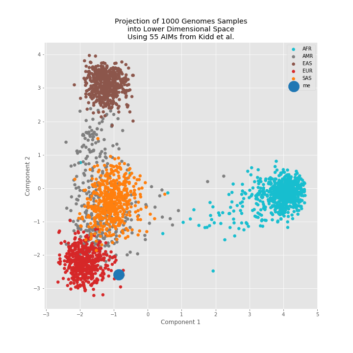

## tgviz
One Thousand Genomes Project --  Population Visualizations  
[http://tgviz.herokuapp.com/](http://tgviz.herokuapp.com/)

### How well do published *ancestry informative* SNPs discriminate between populations in the One Thousand Genomes Project?  
This app and supporting jupyter notebooks (in `notebooks/`) provide Python functions and visualizations that can help answer this question.

tgviz is an interactive visualization app built in Python with [Dash](https://plot.ly/products/dash/) and [deployed](https://dash.plot.ly/deployment) on [Heroku](https://heroku.com). Developing this app was an opportunity to familiarize myself with the Dash framework. Be sure to read the `README` below the visualization on the app page to see more details.

### App Performance
After landing on the site, please allow a few seconds for the application to start.

Switching between `PCA` and `UMAP` dimensionality reduction algorithms are relatively quick, however selecting `TSNE` takes 15-20 seconds to load. `TSNE` is

### Project Personal Genotypes
The [plot_walkthrough.ipynb](https://github.com/arvkevi/tgviz/blob/master/notebooks/plot_walkthrough.ipynb) in the notebooks directory outlines how to project genotype data from your own `.vcf` into this space.

### Contributing
Contributions are welcome, if you find a bug or an inaccuracy, submit an issue, if you would like work on an open issue, or improve the app, submit a Pull Request.
